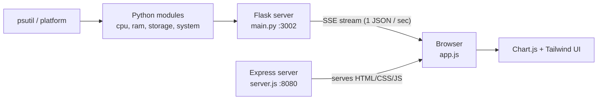

# 🖥️ System Monitor Dashboard

A real-time system monitoring dashboard. A **Python (Flask)** backend collects CPU, RAM, swap, storage and OS information using `psutil` and streams it every second over **Server-Sent Events (SSE)**. A **Node.js (Express)** server serves a **Tailwind CSS + Chart.js** web dashboard that renders the live data with charts, progress bars and a dark/light theme.


---

## 📑 Table of Contents

- [Screenshots](#-screenshots)
- [Features](#-features)
- [How It Works](#-how-it-works)
- [Tech Stack](#-tech-stack)
- [Project Structure](#-project-structure)
- [Prerequisites](#-prerequisites)
- [Installation](#-installation)
- [Running the Project](#-running-the-project)
- [API Reference](#-api-reference)
- [Configuration](#-configuration)
- [File-by-File Explanation](#-file-by-file-explanation)
- [Dashboard Sections](#-dashboard-sections)
- [Running in the Background](#-running-in-the-background)
- [Troubleshooting](#-troubleshooting)
- [Roadmap](#-roadmap)
- [Contributing](#-contributing)
- [License](#-license)

---

## 📸 Screenshots

> Add your screenshots in a `docs/` folder and update the paths below.

| Dark Theme | Light Theme |
|:---:|:---:|
|  |  |

---

## ✨ Features

- ⚡ **Live updates every 1 second** using Server-Sent Events (no polling, no page refresh)
- 🧮 **CPU monitoring**: total usage, per-core usage, physical/logical core count, current frequency
- 🧠 **RAM & Swap monitoring**: total, used, available, percentage, with history charts and a donut chart
- 💾 **Storage monitoring**: every mounted partition with device, mountpoint, filesystem, used/free/total
- 🐧 **System information**: OS, version, architecture, hostname, boot time and uptime
- 📈 **Rolling history charts**: last 60 data points for CPU, RAM and Swap
- 🌗 **Dark / Light theme** with the choice saved in `localStorage`
- 🔁 **Auto-reconnect** with exponential backoff (1s → 10s) if the backend goes down
- 🟢 **Connection status indicator**: Connecting / Live / Reconnecting
- 🌍 **Cross-platform backend**: Linux, Windows and macOS
- 🌐 **LAN friendly**: the dashboard automatically talks to the backend on whatever host you opened it from

---

## 🔍 How It Works



**Step by step:**

1. `psutil` and `platform` read live system data from the operating system.
2. The small helper modules (`cpu_monitor.py`, `ram_monitor.py`, `storage_monitor.py`, `system_info.py`) return that data as Python dictionaries.
3. `main.py` combines them into one JSON snapshot (`build_snapshot()`), adds human-readable sizes (e.g. `7.82 GB`) and uptime.
4. The Flask route `/api` keeps the HTTP connection open and sends one snapshot per second in the SSE format (`data: {...}\n\n`).
5. In the browser, `app.js` opens an `EventSource` connection to that endpoint.
6. Every time a message arrives, `app.js` updates the numbers, progress bars and charts.
7. `server.js` (Express) only serves the static frontend files on port `8080`.

> **Why SSE instead of WebSocket or polling?**
> SSE is one-way (server → browser), built into every modern browser, reconnects automatically and is much simpler than WebSockets. A monitoring dashboard only needs data flowing in one direction, so SSE is a perfect fit.

---

## 🧰 Tech Stack

| Layer | Technology | Purpose |
|---|---|---|
| Backend | Python 3.11+, Flask | HTTP server and SSE endpoint |
| Backend | flask-cors | Allows the frontend (port 8080) to call the API (port 3002) |
| Backend | psutil | Reads CPU, RAM, swap, disk and boot time |
| Frontend server | Node.js, Express | Serves the static dashboard files |
| Styling | Tailwind CSS 3, PostCSS, Autoprefixer | Utility-first styling and dark mode |
| Charts | Chart.js | Line charts and the RAM donut chart |
| Frontend logic | Vanilla JavaScript | SSE connection, rendering, theme handling |

---

## 📁 Project Structure

Recommended layout for the repository:

```text
system-monitor-dashboard/
├── backend/
│   ├── main.py               # Flask app + SSE endpoint (entry point)
│   ├── cpu_monitor.py        # CPU data
│   ├── ram_monitor.py        # RAM and swap data
│   ├── storage_monitor.py    # Disk / partition data
│   ├── system_info.py        # OS and boot-time data
│   ├── utils.py              # Helper functions (bytes → human readable)
│   ├── index.html            # Simple API landing page
│   ├── favicon.ico
│   └── requirements.txt      # Python dependencies
│
├── frontend/
│   ├── index.html            # Dashboard page
│   ├── app.js                # SSE client, charts, rendering logic
│   ├── style.css             # Tailwind input file + custom CSS
│   ├── output.css            # Generated Tailwind CSS (build output)
│   ├── server.js             # Express static file server
│   ├── tailwind.config.js    # Tailwind configuration
│   ├── postcss.config.js     # PostCSS configuration
│   ├── package.json
│   └── package-lock.json
│
├── docs/                     # Screenshots for the README
├── .gitignore
├── LICENSE
└── README.md
```

---

## ✅ Prerequisites

| Tool | Version | Check with |
|---|---|---|
| Python | 3.11 or newer | `python --version` |
| pip | latest | `pip --version` |
| Node.js | 18 or newer | `node --version` |
| npm | comes with Node.js | `npm --version` |

> Tkinter is **not** required. This project uses a web dashboard, not a desktop GUI.

---

## 📦 Installation

### 1. Clone the repository

```bash
git clone https://github.com/<your-username>/system-monitor-dashboard.git
cd system-monitor-dashboard
```

### 2. Backend setup (Python)

Using a virtual environment is recommended.

**Option A: venv**

```bash
cd backend
python -m venv venv

# Linux / macOS
source venv/bin/activate

# Windows
venv\Scripts\activate

pip install -r requirements.txt
```

**Option B: Conda**

```bash
conda create -n system-monitor python=3.11 -y
conda activate system-monitor
cd backend
pip install -r requirements.txt
```

### 3. Frontend setup (Node.js)

```bash
cd frontend
npm install
```

### 4. Build the Tailwind CSS (first time only)

```bash
npx tailwindcss -i ./style.css -o ./output.css
```

This generates `output.css` from `style.css` by scanning `index.html` and `app.js` for the Tailwind classes you use.

---

## ▶️ Running the Project

You need **two terminals**: one for the backend and one for the frontend.

### Terminal 1: Backend (Flask, port 3002)

```bash
cd backend
python main.py
```

Expected output:

```text
====================================================================
  🚀 SSE JSON Stream Server
====================================================================
  Stream :  http://192.168.x.x:3002/api
  Interval: 1.0s  |  Press CTRL+C to stop
====================================================================
```

### Terminal 2: Frontend (Express, port 8080)

```bash
cd frontend
npm start
```

For development with automatic Tailwind rebuilds:

```bash
npm run dev
```

### Open the dashboard

| Where | URL |
|---|---|
| Same computer | http://localhost:8080 |
| Another device on your Wi-Fi/LAN | `http://<your-pc-ip>:8080` |
| Raw SSE stream (for testing) | http://localhost:3002/api |

> The frontend builds the API address as `http://<current-hostname>:3002/api`, so opening the dashboard from another device on your network works without any code changes.

---

## 📡 API Reference

### `GET /`

Returns basic information about the server in JSON.

```json
{
  "name": "System Monitor SSE Stream",
  "stream": "http://192.168.1.11:3002/api",
  "interval_seconds": 1.0
}
```

### `GET /api`

An SSE stream (`Content-Type: text/event-stream`). One JSON message is sent every second.

**Quick test from the terminal:**

```bash
curl -N http://localhost:3002/api
```

**Sample message:**

```json
{
  "status": "ok",
  "timestamp": 1790000000.123,
  "cpu": {
    "usage_percent": 12.5,
    "cores_physical": 4,
    "cores_logical": 8,
    "frequency": 2400.0,
    "per_cpu": [10.2, 15.0, 8.7, 20.1, 5.0, 9.9, 11.3, 14.8]
  },
  "ram": {
    "total": 16777216000,
    "used": 8388608000,
    "available": 8388608000,
    "percent": 50.0,
    "total_human": "15.62 GB",
    "used_human": "7.81 GB",
    "available_human": "7.81 GB",
    "swap_total": 2147483648,
    "swap_used": 0,
    "swap_percent": 0.0,
    "swap_total_human": "2.00 GB",
    "swap_used_human": "0.00 B"
  },
  "storage": [
    {
      "device": "/dev/sda1",
      "mountpoint": "/",
      "fstype": "ext4",
      "total": 500107862016,
      "used": 120000000000,
      "free": 380107862016,
      "percent": 24.0,
      "total_human": "465.76 GB",
      "used_human": "111.76 GB",
      "free_human": "353.99 GB"
    }
  ],
  "system": {
    "os": "Linux",
    "os_version": "#1 SMP PREEMPT_DYNAMIC",
    "os_release": "6.6.0",
    "architecture": "x86_64",
    "hostname": "my-pc",
    "boot_time": 1789990000.0,
    "uptime_seconds": 10000,
    "uptime_human": "2h 46m"
  }
}
```

### Field reference

| Field | Type | Description |
|---|---|---|
| `status` | string | `"ok"` on success, `"error"` if a snapshot failed |
| `timestamp` | float | Unix time (seconds) when the snapshot was created |
| `cpu.usage_percent` | float | Overall CPU usage in % |
| `cpu.per_cpu` | float[] | Usage per logical core in % |
| `cpu.cores_physical` / `cores_logical` | int | Physical and logical core counts |
| `cpu.frequency` | float | Current CPU frequency in MHz (`0` if unavailable) |
| `ram.*` | number / string | Raw bytes plus `_human` readable versions |
| `ram.swap_*` | number / string | Swap memory values |
| `storage[]` | array | One object per mounted partition |
| `system.uptime_human` | string | Uptime like `1d 4h 12m` |

**Error message format** (sent if something fails while building a snapshot):

```json
{ "status": "error", "message": "description of the error", "timestamp": 1790000000.123 }
```

The frontend ignores any message whose `status` is not `"ok"`.

---

## ⚙️ Configuration

### Backend: `backend/main.py`

| Variable | Default | Description |
|---|---|---|
| `HOST` | `0.0.0.0` | Listen on all network interfaces (use `127.0.0.1` for local only) |
| `PORT` | `3002` | Backend port |
| `API_ENDPOINT` | `/api` | SSE route |
| `INTERVAL` | `1.0` | Seconds between updates |

### Frontend: `frontend/server.js`

| Variable | Default | Description |
|---|---|---|
| `PORT` | `8080` | Port of the Express server |

### Frontend: `frontend/app.js`

| Variable | Default | Description |
|---|---|---|
| `API_URL` | `http://<hostname>:3002/api` | Where the SSE stream is read from |
| `MAX_POINTS` | `60` | Number of points kept in each history chart (about 60 seconds) |

> If you change `PORT` in `main.py`, change the port inside `API_URL` in `app.js` as well.

---

## 📄 File-by-File Explanation

### Backend

| File | What it does |
|---|---|
| `main.py` | Creates the Flask app, enables CORS, builds the JSON snapshot, exposes `/` and `/api`, and prints the server address on start |
| `cpu_monitor.py` | `get_cpu_info()` returns total usage, per-core usage, core counts and frequency using `psutil` |
| `ram_monitor.py` | `get_ram_info()` returns RAM and swap totals, usage and percentages |
| `storage_monitor.py` | `get_storage_info()` loops over all partitions and returns usage for each; partitions without permission are skipped |
| `system_info.py` | `get_system_info()` returns OS name, version, release, architecture, hostname and boot time |
| `utils.py` | `bytes_to_human()` converts bytes into `B / KB / MB / GB / TB`; `bytes_to_gb()` converts bytes into GB |
| `index.html` | A small landing page that links to the SSE stream |
| `requirements.txt` | Python dependencies: `psutil`, `flask`, `flask-cors` |

### Frontend

| File | What it does |
|---|---|
| `index.html` | The dashboard layout (cards, chart canvases, sections) |
| `app.js` | Theme toggle, Chart.js setup, SSE connection with auto-reconnect, and all render functions |
| `style.css` | Tailwind directives plus custom styles (smooth transitions, scrollbar, progress bar, hover cards, pulsing status dot) |
| `output.css` | Final CSS generated by Tailwind (do not edit by hand) |
| `tailwind.config.js` | Enables class-based dark mode, scans `index.html` and `app.js`, defines the `brand` color palette and the Inter font |
| `postcss.config.js` | Runs Tailwind and Autoprefixer |
| `server.js` | Express server that serves the folder as static files on port 8080 |
| `package.json` | Scripts (`start`, `build:css`, `dev`) and dependencies |

### Key functions in `app.js`

| Function | Purpose |
|---|---|
| `applyTheme(theme)` | Adds or removes the `dark` class and saves the choice |
| `makeLineChart(id, color)` | Creates a gradient-filled line chart |
| `pctColor(p)` | Chooses a progress-bar color: green below 50%, orange below 80%, red from 80% |
| `renderCPU(cpu)` | Updates CPU cards, per-core grid and CPU chart |
| `renderRAM(ram)` | Updates the top RAM and Swap cards |
| `renderMemory(ram)` | Updates the memory section, charts and donut |
| `renderStorage(devices)` | Builds one card per storage device |
| `renderSystem(sys)` | Fills the system information grid, uptime and hostname |
| `connectSSE()` | Opens the `EventSource`, handles messages and reconnects on error |

---

## 📊 Dashboard Sections

| Section | What you see |
|---|---|
| **Header** | Hostname, uptime, live connection status, last update time, theme toggle |
| **Top cards** | CPU, RAM and Swap usage with progress bars |
| **CPU** | Usage history chart, frequency, core count, per-core usage grid |
| **Memory** | RAM and Swap history charts, donut chart, total/used/available values |
| **Storage** | One card per partition with a usage bar and used/free/total sizes |
| **System** | OS, version, architecture, hostname, uptime and boot time |

**Color meaning of progress bars:**

| Usage | Color |
|---|---|
| Below 50% | 🟢 Green |
| 50% to 79% | 🟠 Orange |
| 80% and above | 🔴 Red |

---

## 🌙 Running in the Background

Linux / macOS, keep the backend running after closing the terminal:

```bash
cd backend
nohup python main.py > server.log 2>&1 &
```

View the log:

```bash
tail -f server.log
```

Stop it:

```bash
pkill -f "python main.py"
```

> Flask's built-in server is meant for development and local/LAN use. For a public deployment use a production WSGI server such as Gunicorn, with a worker setup that supports long-lived streaming connections.

---

## 🛠️ Troubleshooting

| Problem | Possible cause | Solution |
|---|---|---|
| Status stays on **Reconnecting...** | Backend is not running or wrong port | Start `python main.py` and check port `3002` |
| Dashboard looks unstyled | `output.css` is missing or outdated | Run `npx tailwindcss -i ./style.css -o ./output.css` |
| New Tailwind classes have no effect | CSS was not rebuilt | Run `npm run dev` (watch mode) or rebuild manually |
| Works on localhost but not from another device | Firewall blocks ports | Allow ports `8080` and `3002`, and make sure both devices are on the same network |
| CPU shows `0%` at the very first message | `psutil.cpu_percent(interval=None)` has no earlier reading on the first call | Normal; the value is correct from the second second onward |
| `Address already in use` | Port is occupied | Stop the other process or change the port in the config |
| `ModuleNotFoundError: No module named 'flask'` | Dependencies not installed | Activate your environment and run `pip install -r requirements.txt` |
| `npm run build:css` can't find the input file | Wrong input file name in `package.json` | Make sure the script uses `./style.css` |
| CPU frequency shows `N/A` | Some systems or virtual machines do not expose it | Expected behavior |

---

## 🗺️ Roadmap

- [ ] Network usage (upload / download speed)
- [ ] Top processes table
- [ ] CPU temperature and battery information
- [ ] GPU monitoring
- [ ] Docker support (`Dockerfile` and `docker-compose.yml`)
- [ ] Configurable refresh interval from the UI
- [ ] Alerts when usage crosses a threshold

---

## 🤝 Contributing

Contributions are welcome.

1. Fork the repository
2. Create a branch: `git checkout -b feature/my-feature`
3. Commit your changes: `git commit -m "Add my feature"`
4. Push the branch: `git push origin feature/my-feature`
5. Open a Pull Request

---

## 📜 License

This project is licensed under the **MIT License**. See the [LICENSE](LICENSE) file for details.

---

<p align="center">Made with ❤️ using Python, Flask, Node.js, Tailwind CSS and Chart.js</p>
